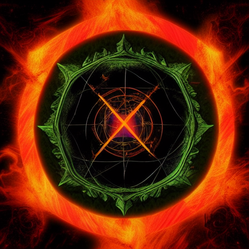
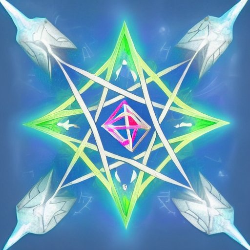
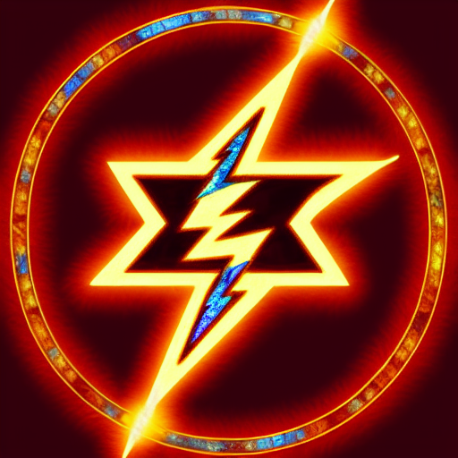
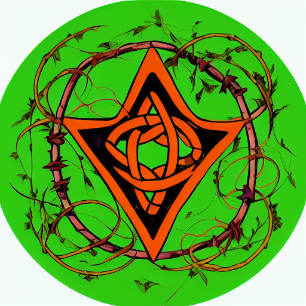
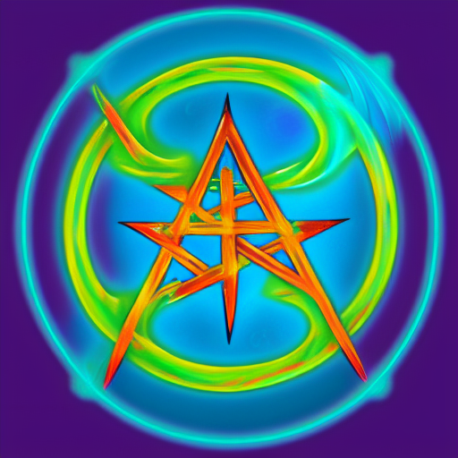
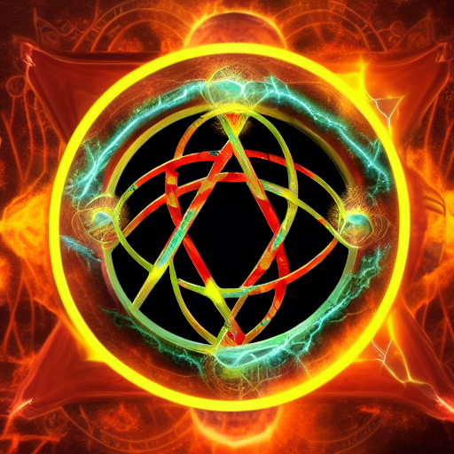
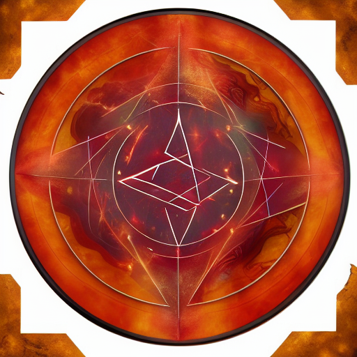
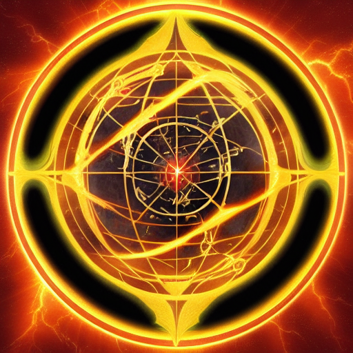

# Digital Sigils on the Ethereum Blockchain
Web3 Layer of the [Digil Project](https://digil.app)  
**Website**: [digil.co.in](https://digil.co.in)

### What is a Digil?

A Digil is a Digital Sigil. So what is a Sigil?
> A sigil is a type of symbol used in magic. In modern usage, especially in the context of chaos magic, sigil refers to a symbolic representation of the practitioner's desired outcome.[?](https://en.wikipedia.org/wiki/Sigil)  

## Digil Coin | ERC20 Token
**Symbol**: DIGIL  
**Contract Address**: [0xa4101FEDAd52A85FeE0C85BcFcAB972fb7Cc7c0e](https://etherscan.io/token/0xa4101fedad52a85fee0c85bcfcab972fb7cc7c0e)  

## Digil Token | ERC721 Token (NFT)
**Symbol**: DiGiL  
**Contract Address**: [0xf16Bd22EB4C1463575D929F98250e4fff8E8D6a2](https://etherscan.io/token/0xf16bd22eb4c1463575d929f98250e4fff8e8d6a2)

### Solidity Version 0.8.15 Compiler Warnings

This contract is unaffected by the `StorageWriteRemovalBeforeConditionalTermination` Solidity bug introduced in compiler version 0.8.13, as it doesn’t contain any inline assembly block with `return(...)` statements that use a storasge write.

This contract is unaffected by the `AbiReencodingHeadOverflowWithStaticArrayCleanup` Solidity bug introduced in compiler version 0.5.8, as there are no conditions in which it should need to perform ABI-encoding of a statically-sized calldata arrays as the last component of a tuple.  

### Contract Configuration

**Coin Rate**: The maximum number of bonus Coins distributed on withdrawal, and the rate used to determine the cost of certain Actions (Opt-Out; Linking Tokens; Overwriting a Token's URI).  

**Minimum Incremental Value**: The minimum value that can be used to Charge a Payable Token. Is also used to determine the cost of certain Actions (Opt-Out; Restricting, Discharging, or Destroying a Token; Overwriting a Token's URI).  

**Transfer Value**: A fraction of the Minimum Incremental Value that will be used to calculate value distributions.   

### Tokens

#### Basic Properties

**Charge**: The value in Coins used to Charge the Token  
**Active Charge**: Charge that was generated by Activation, or transferred to this Token from a Linked Token  
**Activation Threshold**: The number of Coins required before a Token can be Activated  

**Value**: The value in eth above and beyond the Incremental Charge Value that is associated with this Token  
**Incremental Value**: The value in eth required in tandem with each Coin to Charge the Token (can be zero)  
**Incremental Charge Value**: The value in eth derived from the number of Coins used to Charge the Token, and its Incremental Value  

**Links**: A collection of Tokens that this Token Links to

**Contributions**: Addresses that contribute to the Token's Charge are tracked, so that any contributions can be returned when a Token is Destroyed or Discharged, or when a Token's Value is being distributed after the Token has been Activated

#### Planes

Planes are special Tokens that can be linked to at Token Creation.  

**Void**1, **Karma**2, **Kaos**3  

**Elemental Planes**: Fire4, Air5, Earth6, Water7  

**Paraelemental Planes**: Ice8, Lightning9, Metal10, NAture11  

**Harmony**12, **Discord**13, **Entropy**14, **Negentropy/Exergy**15, **Magick**16  

**Aether**17, **World**18  

#### Creation

When **Creating** a Token, you specify its Incremental Value, Activation Threshold, whether or not the Token Contributions should be restricted to those on a whitelist, the Plane to link it to (if any), and the Data to store with the Token. Any eth sent at Token creation will be stored as the Token's Value. A Token's Incremental Value, Activation Threshold, and Restricted State can be **Updated** after creation, however, its Data cannot.  

#### Charging

Digil Coins can be used to **Charge** a Token. If a Token has an Incremental Value, that value must also be sent for each Coin that is used to Charge the Token. Any additional eth sent beyond that which is required by the Incremental Charge Value, will be added to the Token's Value.  

When a Token is **Discharged** that has not yet been Activated, any Contributions will be redistributed to their Contributors, with the Token's Value being distributed to its owner regardless of its source. When an Active Token is Discharged, the sum of Token's Incremental Charge Value will be distributed to the Token's owner, while the Token's Value will be divided amongst the Token's Contributors. **Destroying** a Token will first Discharge it before Burning it, making it inaccessible.

#### Linking

Tokens can be **Linked** and **Unlinked** from one another in order to facilitate the generation or transferring of Coins on Charge or Activation. This allows one to Charge multiple Tokens at once. Links have an Efficiency that determines the number of Coins generated when the Link is executed.

#### Activation

Once a Token has a Charge that is greater than or equal to its Activation Threshold, it can be **Activated**. Activating the Token distributes its Value to those who have Contributed, and distributes its Charge Value to the owner of the Token. Once a Token has been Activated, it can be **Deactivated**

#### Restricted Token

Tokens have the ability to be **restricted**. Addresses must be added to a Restricted Token's **whitelist** before they can Contribute to (Charge), or Link to a Token. Once an address has been added to a Token's whitelist, it cannot be removed. An address is automatically added to a Token's whitelist upon successful transfer to said address. A token can be restricted at creation, or its restricted state can be set at any time by the Token's owner.  

Because restricting a Token limits who can Contribute to it, it also limits who can receive a portion of the Token's Value when it is Activated.  

#### Contract Token

**ERC721 Tokens** (NFTs), can be sent to this contract and will be Linked to a newly created Digil Token. The Digil Token that is created has an initial Incremental Value equal to the Minimum Incremental Value, or, if the Token sent itself is a Digil Token, the greater of either the Minimum Incremental Value or the Digil Token's Incremental Value. The ERC721 Token can then be **Recalled** (sent to the current Digil Token owner), but only after the new Digil Token has been either Activated or Destroyed.  

### Withdrawls

When a Token is Activated, Destroyed, Discharged, or an Active Token is Charged, it has the potential to generate value in the form of eth and or Coins. This value is stored as a Pending Distribution which can then be **withdrawn**.  

In addition to Pending Distributions, a bonus Coin is available every 15 minutes (up to the maximum as set by the Coin Rate), for those who already hold Coins, Tokens, or have any pending eth distributions.  

### Blacklist and Opt-Out

There are two ways an address can be **blacklisted**. The first is if the contract admin adds the address to the blacklist. The second is if the address **opts-out** of the contract. In both cases, being placed on the blacklist blocks withdrawals, and prevents Tokens from being transferred to or from the address. Those on the blacklist are also prevented from Creating, Charging, Destroying, Discharging, Activating, Deactivating, Linking, and Unlinking Tokens.  

An address can only be removed from the blacklist by being **whitelisted** by the contract admin.  
