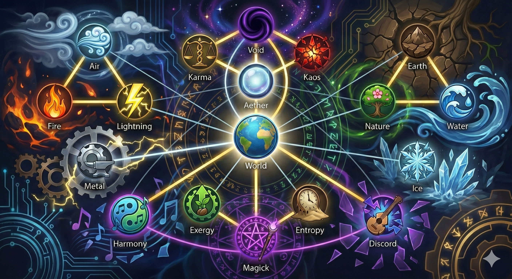

# Digital Sigils on the Ethereum Blockchain
The Web3 Layer of the [Digil Project](https://digil.app)  
**Website**: [digil.co.in](https://digil.co.in)

## What is a Digil?
A **Digil** (Digital Sigil) is an ERC-721 **dynamic NFT** that can hold **intrinsic value (ETH)** and accumulate **energy (ERC-20 “coins”)**. Owners and contributors can **charge**, **activate**, **link**, **buff**, **deactivate**, and **discharge** Digils; the contract fairly tracks and redistributes ETH/coins using on-chain rules and events.

Conceptually, a Digil behaves like a **rechargeable node** that can power neighboring nodes when linked. Metaphorically, it is a programmable servitor, a vessel for your intent. By inscribing it on the blockchain, charging it with value (gnosis), and linking it to other constructs, you create a complex circuit of will that manifests through the movement of value and energy.

> A sigil is a type of symbol used in magic. In modern usage, especially in the context of chaos magic, sigil refers to a symbolic representation of the practitioner's desired outcome.<sup>[?](https://en.wikipedia.org/wiki/Sigil)</sup>



---

## Table of Contents
- [Contracts](#contracts)
- [Planar Tokens & Base URI](#planar-tokens--base-uri)
- [Global Configuration](#global-configuration)
- [Per-Token Properties](#per-token-properties)
- [Lifecycle](#lifecycle)
  - [Create](#create)
  - [Charge](#charge)
  - [Activate](#activate)
  - [Mathematics of Activation Payouts](#mathematics-of-activation-payouts)
  - [Deactivate](#deactivate)
  - [Discharge](#discharge)
- [Read-Only Views](#read-only-views)
- [Linking & Affinity](#linking--affinity)
  - [Temporary Buffs (Efficiency, Attunement, Amplification, Anchor, Reverb)](#temporary-buffs-efficiency-attunement-amplification-anchor-reverb)
  - [Stabilization (Anti-Bleed)](#stabilization-anti-bleed)
  - [Priming (Acceleration)](#priming-acceleration)
  - [Overcharging](#overcharging)
- [Vaulting External ERC-721s](#vaulting-external-erc-721s)
- [Distributions, Withdrawals & Bonuses](#distributions-withdrawals--bonuses)
- [Contributor Reclaim](#contributor-reclaim)
- [Opt-Out / Blacklist](#opt-out--blacklist)
- [Admin & Security Notes](#admin--security-notes)
- [Pricing and Costs](#pricing-and-costs)
- [How it Works: End-to-End Examples](#how-it-works-end-to-end-examples)

---

## Contracts

### Digil Coin | ERC-20
**Symbol**: DIGIL • **Address**: TBD

Used for **charge units**, feature fees (linking, metadata updates, opt-out), and **bonuses**. In the context of the system, these coins represent **Gnosis** or kinetic energy. They are the fuel required to power the ritual. Internally the contract normalizes coin math with a **coin multiplier**: `10**decimals`. Where we say “coins,” we mean base units at this precision.

### Digil Token | ERC-721
**Symbol**: DIGILS • **Address**: TBD

Implements core NFT logic plus the esoteric machinery of the system:
- **Economics**: per-token `charge` (potential energy), `activeCharge` (kinetic energy), and ETH `value` (material sacrifice); per-address contribution ledgers; pending distributions.
- **Batched workflows**: `activateToken`, `dischargeToken` process contributors in pages using `distributionIndex` and a configurable `_batchSize`.
- **Link graph**: up to 10 links per token with `LinkEfficiency`, optional **temporary buffs**, and plane-driven bonuses. This forms the "Ley Lines" connecting your intentions.
- **Vaulting**: accepts external ERC-721s via `onERC721Received` and exposes `recallToken`.
- **Access & safety**: blacklist gating; planar invariants; `nonReentrant` on sensitive paths; robust event surface; custom errors.

In short, it’s both the **scoreboard** and the **settlement engine** for your digital workings.

---

## Planar Tokens & Base URI

At deployment the contract mints **21 planar tokens** (IDs `0..20`) to the admin. These embed compact **affinity metadata** (bytes) used by the link bonus algorithm. These are the **Archetypes**—the fundamental forces of the Digil reality to which your specific intention aligns.

- Core: **Void (1), Karma (2), Kaos (3)**
- Elemental: **Fire (4), Air (5), Earth (6), Water (7)**
- Para-elemental: **Ice (8), Lightning (9), Metal (10), Nature (11)**
- Energy: **Harmony (12), Discord (13), Entropy (14), Exergy (15), Magick (16)**
- Ethereal: **Aether (17), World (18)**
- Extended: **Virtual (19), ILXR (20)**

**Invariants**
- Planar IDs are **admin-locked**: non-burnable; only `owner()` or the contract can operate them. Approvals are ignored for these IDs.
- During `transferOwnership`, a short **planar transfer window** opens so planar tokens held by the outgoing admin can be moved to the new admin. Otherwise, planar tokens are **non-transferable**.
- Token **#0** controls the collection **base URI**; `_baseURI()` returns token #0’s URI. Updating #0 updates the effective base for default `tokenURI`s.

**Practical note**: End-user Digils may **align** to a foundational plane during creation (see Create). That alignment doesn’t create a user-visible token transfer—it sets internal state used by the **affinity** algorithm to determine how your sigil resonates with others.

---

## Global Configuration

Owner-only:

```solidity
configure(coins, incrementalValue, transferValue, batchSize)
```

with checks:
- `_coinRate = coins × coinMultiplier` • `coins ∈ (10, 1,000,000,000]`
- `_incrementalValue > 1000 gwei ≤ 1 ether` (global per-coin ETH floor)
- `_transferValue ∈ [0.9, 0.99] × _incrementalValue` (between 1% and 10% fee)
- `_batchSize ≥ 32 ≤ 1024`

**Core constants**
- `BONUS_INTERVAL = 15 minutes` → withdraw time bonus step.
- `VALUE_MULTIPLIER = 1000 gwei` (used for default minimums).
- `PLANAR_MAX_ID = 18`, `PLANAR_TRANSFER_MAX_ID = 20`.
- `MAX_LINKS = 10`.
- Reclaim timeout:
  - `STALLED_TIMEOUT = 90 days` → window after which contributors can reclaim value from inactive tokens.
- Affinity helpers: `AFFINITY_BOOST = 2`, `AFFINITY_REDUCTION = 2`.

**Link buff configuration**
- `MAX_BUFF_BONUS = 100` — cap on temporary bonus applied to outgoing links (percentage points).
- `MAX_BUFF_DURATION_MIN = 24 × 60` — maximum buff duration (24 hours, in minutes).
- `LINK_BUFF_COST_FACTOR = 24 × 60` — calibration constant for buff pricing in terms of `activeCharge`.
- `BUFF_COST = 50` — Magnitude cost added for special flags (Attunement, Anchored, Primed, Reverb).

These dials collectively shape the physics of the Digil universe: fees (offerings), minimum ETH coupling (material requirement), payout fairness, and the economics of **buffs** (ritual enhancements).

---

## Per-Token Properties

**Economics**
- `charge` — pre-activation coins (base units); grows via `chargeToken/As` on inactive tokens. Think of this as **Potential Energy**.
- `distributionCharge` / `distributionValue` — snapshots used when a distribution is in progress.
- `activeCharge` — post-activation working coins; also accrues from link inflows, some overpay scenarios, and is **spent** by buffs and certain thematic effects. This is **Kinetic Energy**.
- `value` — intrinsic ETH the token holds. The material backing of the intent.
- `incrementalValue` — per-coin ETH requirement for *this* token (can be 0 but must be ≥ global min if set).
- `activationThreshold` — required coins to allow activation. The critical mass required to fire the sigil.

**Workflow state**
- `activating` / `discharging` — multi-tx operation flags.
- `distributionIndex` — cursor into `contributors[]` for paging.
- `contributionEpoch` — logical epoch; incrementing this treats all prior `TokenContribution` entries as reset without clearing the mapping.
- `lastActivity` — updated on meaningful operations; used by **contributor reclaim** logic. It is only bumped when an operation actually succeeds (charges, lifecycle transitions, link updates, buffing, reclaiming, etc.).

**Links & contributors**
- `links[]` (≤ 10) • `linkEfficiency[linkId].base` and `.affinityBonus` (percent-like integers).
- `buff { efficiencyBonus, attunement, amplification, flags, expiresAt }` — optional **temporary buffs** applied to the token. `flags` is a bitmask for special states: `STABILIZED (1)`, `ANCHORED (2)`, `PRIMED (4)`, `REVERBERATED (8)`.
- `contributors[]` plus per-address  
  `TokenContribution { charge, value, epoch, exists, distributed, whitelisted }`.

**Metadata & flags**
- `data` (bytes) and `uri` (string). Planar tokens require `data.length ≥ 4` to preserve the affinity codec.
- `active` and `restricted`. New owners are **auto-whitelisted** for the token.

This is a **mini-ledger** per token: balances, connections (including temporary buffs), contributors, and progress cursors for safe, resumable payouts and resets.

---

## Lifecycle

The existence of a Digil follows a ritual path: **Inscription (Create)** → **Gnosis (Charge)** → **Firing (Activate)**. Eventually, the energy can be grounded: **Banishment (Deactivate)** and **Release (Discharge)**.

### Create

```solidity
createToken(
  uint256 incrementalValue,
  uint256 activationThreshold,
  bool    restricted,
  uint256 plane,
  bytes   data
)
```

- Enforces `incrementalValue == 0 || incrementalValue ≥ globalMin`.
- If `restricted = true`, caller must send `ETH ≥ max(token.incrementalValue, globalMin)`.
- If `plane ∈ [1..PLANAR_MAX_ID]`, charges a one-time **coin fee tier** (see [Admin & Security Notes](#admin--security-notes)) and records the alignment with base 100% link to that plane (internal only). This aligns your new construct with a fundamental elemental force.
- Any `msg.value` becomes token `value`.
- Returns the new `tokenId` minted to the caller.

### Charge

`chargeToken(tokenId, coins)` and  
`chargeTokenAs(contributor, tokenId, coins)` (the latter is `nonReentrant`)

To empower the sigil, participants must offer material value (ETH, conditional) and energetic value (Coins).

- **Inputs**: `coins` (base units) and `msg.value` (ETH).  
  If `contributor ≠ caller` (proxy), call must include at least:  
  `requiredValue = max(token.incrementalValue, globalMin)`.
- **Inactive token path (Building Potential)**:
  - Compute minimum ETH for the requested coins:  
    `minValue = token.incrementalValue × (coins / coinMultiplier)`.  
  - Record `minValue` as the contributor’s **value**; excess ETH → token `value`.
  - If provided coins exceed the minimum implied by ETH, surplus coins go to `activeCharge`.
  - Emits `Contribute`, `ContributeValueAs`, `Charge` as appropriate.
- **Active token path (Active Charging)**:
  - If the token has **no links**, all coins (plus any `activeCoins` used in linked paths) credit `activeCharge`.
  - If the token **has links** (Sympathetic Connections):
    - ETH is evenly split across the links.
    - Coins are apportioned per link by:
      - `linkedCoins = (coins × effectiveBaseEfficiency) / links.length / 100`
      - `bonusCoins = (coins × affinityBonus) / 100`
    - Here, `effectiveBaseEfficiency` is the link’s base efficiency **plus any active efficiency buff**, capped at 255.
    - For each link, `_chargeToken` runs in **link mode**, which:
      - Does **not** pull ERC-20 from the contributor.
      - Still enforces restriction/whitelist and minimum ETH/coin logic, and may also use the source’s `activeCoins` when charging via links.
    - If a target link cannot be charged (fails checks), its slice of coins falls back into the source’s `activeCharge`.
    - **Reverb Effect**: If the source token has an active **Reverb Buff** (`REVERBERATED` flag 8), a portion of the coins *successfully propagated* to a link are reflected back to the source as an "echo" (`activeCharge`). The intent resonates and returns to the caster.
    - Unused ETH after linked charging becomes a pending distribution for the source **owner**.
  - **Amplification**: If the token has an active **Amplification Buff**, any coins that remain on the token (either direct deposit or incoming from a link) are multiplied by the amplification factor before being added to `activeCharge`.

### Activate

```solidity
activateToken(tokenId)
```

(multi-tx)

This is the firing of the sigil. The accumulated potential energy is transmuted into active kinetic energy, and the material sacrifice (ETH) is settled.

- Requires `active == false`.
- **Primed Buff**: If the token has an active `PRIMED` (flag 4) buff, the required `activationThreshold` is temporarily halved. The sigil has been greased for easier release. Otherwise, requires `charge ≥ activationThreshold` (or already in `activating` mode).
- Also requires `!discharging`.
- Internally calls `_distribute(tokenId, discharge=false)` in batches:
  - For each contributor:
    - Their contributed ETH share (`distributableTokenValue`) is paid out using `_addDistributedValue`, based on `distributionValue` and `charge` proportions.
    - The token’s `value` is reduced by the same amount.
    - Their original contributed ETH (`contribution.value`) is accumulated into a pool `distribution`.
  - After all contributors:
    - `distributionCharge` is moved to `activeCharge`.
    - The owner receives **`distribution` plus any remaining rounding “dust”** from the token’s value. Internally this is passed through `_addDistributedValue(owner, distribution + tValue)`, so the standard fee split still applies but dust is treated as part of the owner’s payout rather than an extra contract-only pool.
- Emits `Activate(tokenId, false)` while in progress and `Activate(tokenId, true)` on completion.
- The token is then marked `active = true`, and `activating = false`.

#### Mathematics of Activation Payouts

Activation converts an inactive, charged sigil into an active one by **settling ETH from the token’s value back to contributors**, proportionally to how much they charged it.

Let:

- `dCharge` = total charge being distributed at activation time.
- `dValue` = total token value reserved for contributor payouts (snapshot into `distributionValue`).
- `_coinMultiplier` = the ERC-20 base unit multiplier (e.g., `10**18`).

The contract computes a **per-unit value rate**:

```text
incrementalValue = (dValue * _coinMultiplier) / dCharge        // if dCharge > 0, else 0
```

For each contributor `i` with `charge_i`:

```text
payout_i = incrementalValue * charge_i / _coinMultiplier
```

The important properties:

- Each `payout_i` is **proportional** to `charge_i / dCharge`.
- Because of integer division, the total of all `payout_i` is **≤ dValue`.  
  The difference:

```text
dust = dValue − Σ payout_i
```

is “rounding dust” left behind on the token as `t.value`.

At the end of activation:

- All contributor payouts are sent via `_addDistributedValue(contributor, payout_i)` (which itself splits user/contract fee and allocates any bonus coins).
- The token’s remaining `t.value` (including `dust`) is read as `tValue`, then reset to 0.
- The owner receives their **contributed ETH pool** plus this `dust` in one go via:

```solidity
_addDistributedValue(ownerOf(tokenId), distribution + tValue);
```

So the owner’s share includes:

1. The ETH they effectively fronted as part of charging requirements (`distribution`).
2. Any leftover dust from pro-rata payouts (`tValue`).

The contract only ever takes its normal fee percentage via `_addDistributedValue`; there is no separate “dust tax” paid solely to the contract.

### Deactivate

```solidity
deactivateToken(tokenId)
```

Deactivation is a **purely stateful** operation — no ETH moves in or out. It is the banishing of the active construct.

- Requires `active == true` and `charge == 0`.
- Requires no batch in progress (`distributionIndex == 0`).
- On success:
  - Applies a **thematic bleed**:
    - Let `ac = activeCharge`. If `ac > 0`, compute `lost = ac / AFFINITY_REDUCTION` (currently half).
    - New `activeCharge = ac - lost`.
    - The lost portion is no longer tracked by any token; the underlying coins remain in the contract as un-attributed “ambient power”. This represents the entropy cost of breaking the spell.
  - Sets `active = false`.
  - Emits `Deactivate(tokenId)`.

### Discharge

```solidity
dischargeToken(tokenId)
```

(multi-tx; `nonReentrant`)

The final release. The construct is dismantled, value is settled, and remaining energy is grounded or directed outward to its neighbors.

- Requires there is something meaningful to discharge:  
  `t.charge > 0 || t.value > 0 || t.activeCharge > 0 || t.discharging == true`.
- Requires `!activating`.
- On the first call of a discharge cycle, requires:

```text
msg.value ≥ max(globalMin, token.incrementalValue) × max(1, links.length)
```

This scales the discharge cost with link complexity. The value is added to the contract’s pool.

Two main modes:

1. **Inactive token discharge** (`active == false` → `discharge = true`)
   - For each contributor **once per epoch**:
     - Their contributed ETH (`contribution.value`) and coins (`contribution.charge`) are refunded directly via `_addValue(contributor, value, coins)`.
   - After all contributors:
     - Any remaining `t.value` is paid to the **owner** via `_addDistributedValue(owner, tValue)` (again using the standard fee split).
     - `distributionCharge` and `distributionValue` are cleared.

2. **Active token discharge** (`active == true` → `discharge = false`)
   - `_distribute` behaves similarly to activation:
     - Contributors receive a pro-rata share of token `value` via `_addDistributedValue(contributor, distributableTokenValue)`.
     - The owner receives the “required contribution” pool via `distribution`.
     - `distributionCharge` is added to `activeCharge`.
     - Any remaining dust from `token.value` is folded into the owner’s payout: the owner is credited with `distribution + tValue` via `_addDistributedValue(owner, distribution + tValue)`, which still enforces the usual contract fee split.
   - After this **value settlement**, the token can still have `activeCharge`—but it is now treated as **surplus power to be pushed outward**.

After `_distribute` completes in either mode:

- Any remaining `activeCharge` is **redistributed into the token’s links**:
  - **Anchored Buff**: If the token has an active `ANCHORED` (flag 2) buff, ~25% of the `activeCharge` is **retained** on the token before redistribution begins. The energy is bound to the vessel and does not fully dissipate.
  - Sum base efficiencies across links: `sum = Σ base`.
  - Each link receives: `share = ac × base / sum`, added to its `activeCharge`.
  - `ActiveCharge` events are emitted for each link.
  - Any rounding remainder from integer division is effectively **lost** as dust.
- The original token’s `activeCharge` is set to **0** (or the retained amount if Anchored).
- `contributors[]` is cleared and `contributionEpoch` is incremented.
- If a contract token is attached and still present, it becomes **non-recallable** and its address is reinserted as a placeholder contributor for future epochs.
- Any active **link buffs** are cleared.
- `discharging = false` and `Discharge(tokenId, true)` is emitted.

You can read this as: **discharging a sigil settles value, pushes its remaining power outward along its link graph based on base efficiencies, and wipes any temporary buff state**.

---

## Read-Only Views

Several view functions expose token state for off-chain UIs, analytics, or game logic. They do **not** modify state.

### `tokenCharge(tokenId)`

Returns the core economic state of a token:

```solidity
(
  uint256 charge,
  uint256 activeCharge,
  uint256 value,
  uint256 incrementalValue,
  uint256 activationThreshold
)
```

Use this to show a sigil’s current **stored energy**, working **activeCharge**, intrinsic **ETH value**, and its economic parameters.

### `tokenData(tokenId)`

Returns high-level lifecycle and bookkeeping state:

```solidity
(
  bool    active,
  bool    activating,
  bool    discharging,
  bool    restricted,
  uint256 links,
  uint256 contributors,
  uint256 contributionEpoch,
  uint256 distributionIndex,
  bytes   data
)
```

- `links` and `contributors` are **counts**, not arrays.
- `contributionEpoch` can be compared against `tokenData(tokenId).contributionEpoch` to see if a contribution record belongs to the current epoch.
- `distributionIndex` reveals whether a **batch operation is in progress** and how far along it is.
- `data` is arbitrary bytes (planar IDs 0–20 encode affinity data here).

### `tokenContribution(tokenId, contributor)`

Returns raw per-address contribution data:

```solidity
(
  uint256 charge,
  uint256 value,
  bool    exists,
  bool    distributed,
  bool    whitelisted,
  uint256 epoch
)
```

Notes:

- This function is **read-only** and does **not** call the internal `_touchContribution` helper, so it may show pre-reset values from an older epoch.
- To interpret safely:
  - Compare `epoch` with `tokenData(tokenId).contributionEpoch`.
  - If they differ, the contribution is from a **previous logical round** and is effectively stale, even if values are non-zero.
- `distributed` indicates whether this contributor has already been processed in the current distribution/discharge cycle.
- `whitelisted` is preserved across epochs and controls access for restricted tokens.

### `tokenLinkAt(tokenId, index)`

Returns link data for a given source token and index in its `links[]` array:

```solidity
(
  uint256 linkId,
  uint8   baseEfficiency,
  uint256 affinityBonus
)
```

- If `index` is out of range, the call **reverts** with a standard out-of-bounds error. Use `tokenData(tokenId).links` to discover how many links exist before calling.
- `baseEfficiency` and `affinityBonus` are the **stored** efficiency parameters.
- To determine the **effective** efficiency currently applied (accounting for buffs), one would generally use `tokenBuff` data in conjunction with this.

### `tokenBuff(tokenId)`

Returns the current buff state of a token. These are the active enchantments on the sigil:

```solidity
(
    uint64 expiresAt, 
    uint8 efficiencyBonus, 
    uint8 attunement, 
    uint8 amplification, 
    uint8 flags
)
```
- `flags` is a bitmask: 1 = Stabilized, 2 = Anchored, 4 = Primed, 8 = Reverberated.
- `expiresAt` is a Unix timestamp; if `now > expiresAt`, the buff is inactive (except for Stabilized/Primed flags which may persist until consumed).

### `tokenAttachment(tokenId)`

Returns information about vaulted external ERC721 tokens:

```solidity
(
    address contractTokenAddress,
    uint256 externalTokenId,
    bool recallable,
	bool vaulted,
)
```
- If `contractTokenAddress` is non-zero, this Digil wrapped an external NFT.
- `recallable` indicates if `recallToken` can currently be called.
- If `vaulted` if false, but `contractTokenAddress`/`externalTokenId` are non-zero, the external token has been recalled.

---

## Linking & Affinity

```solidity
linkToken(tokenId, linkId, efficiency)
```

(`nonReentrant`)

This is the creation of **Sympathetic Magic** between nodes. By linking Digils, you establish a flow of value. The strength of this connection is determined by **Planar Affinity**—how well the elemental nature of the source aligns with the destination.

- Preconditions:
  - `tokenId != linkId`
  - `linkId > PLANAR_MAX_ID` (you cannot link *to* foundational plane tokens)
  - `links.length < MAX_LINKS`
  - `efficiency > currentBaseEfficiency` for that link (strict improvement)
- Value:
  - `msg.value ≥ source.incrementalValue + dest.incrementalValue`
  - ETH is split evenly between the two tokens: 50% → `tokenId.value`, 50% → `linkId.value`.
- Access:
  - If destination token is `restricted`, the **caller** must be whitelisted on the destination token.
- Affinity bonus:
  - Looks at the tokens’ **foundational planes** (the first link entry if present) and reads their compact `data` bytes.
  - Strong match (`s[1] == d[0]` or `s[2] == d[0]`): base bonus `= 2 × efficiency`.
  - Same plane or ethereal source (IDs > 16): base bonus `= 1 × efficiency`.
  - Weak match (`s[3] == d[0]`): base bonus `= efficiency / 2`.
  - No base bonus → final bonus is 0.
  - Multipliers:
    - Ethereal source (`sourceId > 16`): bonus × 4.
    - Energy source (`12–16`) or destination = World (18): bonus × 2.
  - Charge comparison:
    - If destination’s `activeCharge` > source’s, reduce bonus by half (`/ AFFINITY_REDUCTION`), favoring flows from stronger to weaker planes.
- **Attunement**:
  - If the source token has an active **Attunement Buff** (mimicking a specific plane), the contract calculates the affinity bonus twice: once using the natural plane, and once using the attunement plane.
  - The **larger** of the two bonuses is applied. This ensures attunement is always beneficial or neutral, never detrimental.
- Final link parameters:
  - `linkEfficiency[linkId].base = efficiency`
  - `linkEfficiency[linkId].affinityBonus = max(existingAffinityBonus, computedBonus)`
  - If this is a new link (previous base = 0), `linkId` is appended to the `links[]` array.
- Coin fees:
  - A coin fee is charged that grows with requested `efficiency` and the number of links on the token.
  - The base cost uses a mix of efficiency and a small triangular/quadratic term to keep ultra-high efficiencies expensive.
  - **Early-link discounts** for **new links** on a token:
    - 1st link on a token: **50%** of the base cost.
    - 2nd link on a token: **50%** of the base cost.
    - 3rd+ new links: **100%** of the base cost.
  - Upgrading an **existing link** (increasing efficiency) uses the **full** base cost; early-link discounts only apply when a link is first added to the token.

`unlinkToken(tokenId, linkId)`:

- Clears `linkEfficiency[linkId]` and removes `linkId` from the `links[]` array by swap-and-pop.
- Cannot remove foundational planar links (`linkId ≤ PLANAR_MAX_ID` will revert).
- Emits `Unlink(tokenId, linkId)`.

### Temporary Buffs (Efficiency, Attunement, Amplification, Anchor, Reverb)

```solidity
buffToken(tokenId, efficiency, attunement, amplification, anchor, reverb, duration)
```

(`nonReentrant`)

This function lets the owner **temporarily boost** an active token by spending `activeCharge`. This is a ritual of enhancement, consuming energy to alter the properties of the sigil.

1.  **Efficiency Buff**: Adds a bonus to the base efficiency of all outgoing links.
2.  **Attunement**: Temporarily mimics a specific Planar ID (1-17) for affinity calculations. The sigil vibrates at a different frequency to harmonize with specific neighbors.
3.  **Amplification**: Applies a multiplier to all incoming charge (coins) that stays on the token.
4.  **Anchor** (Flag 2): If set, the token retains ~25% of its `activeCharge` when discharged, instead of distributing 100%. The energy is bound to the vessel.
5.  **Reverb** (Flag 8): If set, a portion of the charge successfully pushed to outgoing links is "echoed" back to the source token as fresh `activeCharge`. The intent creates a feedback loop.

**Inputs**

- `tokenId` — the source sigil to be buffed.
- `efficiency` — additional effectiveness added to each link’s base (0–100).
- `attunement` — the Planar ID to mimic (1-18), or 0 for none.
- `amplification` — the percentage charge multiplier (0-100), or 0 for none.
- `anchor` — (bool) enable ANCHORED behavior during discharge.
- `reverb` — (bool) enable REVERBERATED behavior during active charging.
- `duration` — buff duration in **minutes**, up to 1440 (24 hours).

**Preconditions**

- Token must be **active**.
- `duration` must be in `(0, MAX_LINK_BUFF_DURATION_MIN]`.
- Token must have enough `activeCharge` to pay the cost; otherwise it reverts with `InsufficientActiveCharge`.

**Cost model**

The buff cost is computed in **coin units** and paid entirely from `activeCharge`. The cost is determined by the **Magnitude** of the combined buffs:

```text
magnitude = efficiency + amplification + 
            (attunement > 0 ? BUFF_COST : 0) + 
            (anchor ? BUFF_COST : 0) + 
            (reverb ? BUFF_COST : 0) +
            (Primed ? BUFF_COST : 0)

cost = magnitude × duration_minutes × linkCount × _coinRate / LINK_BUFF_COST_FACTOR
```

- `BUFF_COST = 50`.
- `linkCount` is the number of outgoing links on the source token (minimum 1).
- `LINK_BUFF_COST_FACTOR = 24 × 60`.
- Any **non-zero buff** is clamped to a minimum cost of `_coinRate`.
- Note: `Primed` (Flag 4) is applied via `primeToken`, but its existence adds to the magnitude if you refresh buffs.

**New links during a buff**

If you call `linkToken` to add **another link** while a buff is active:

- The contract charges an additional **per-link buff cost** based on the remaining buff duration:
  - Remaining time is computed in whole minutes (minimum 1).
  - Cost uses the same magnitude calculation formula.
- This ensures that adding new links during an ongoing buff properly **pays into** the buffed state, rather than getting a free ride.

### Stabilization (Anti-Bleed)

```solidity
stabilizeToken(tokenId)
```

(`nonReentrant`)

This function acts as **insurance** against the thematic bleed that occurs during `deactivateToken` or `recallToken`. It is a warding spell that prevents energy loss.

- **Mechanism**: The owner pays ERC-20 Coins upfront to flag the token as `stabilized`.
- **Benefit**: On the next bleed event, the bleed amount (normally ~50% of `activeCharge`) is **skipped**. The stabilization flag is then consumed.
- **Cost**:
  - Base cost is approximately **25%** of current `activeCharge` (calculated as `ac / 4`), subject to a minimum floor.
  - This allows users to pay a smaller fee (~25%) to save the larger loss (~50%).
  - If the token currently has an active **efficiency buff**, the stabilization cost is discounted (`cost * 100 / (100 + efficiency)`).

### Priming (Acceleration)

```solidity
primeToken(tokenId)
```

(`nonReentrant`)

Priming acts as a **catalyst**, greasing the ethereal gears to make the next firing (activation) easier.

- **Mechanism**: The owner pays an upfront coin fee to set the `PRIMED` flag on an inactive token.
- **Benefit**: The `activationThreshold` is temporarily **halved** for the next activation attempt. Once the token is successfully activated, the primed status is consumed.
- **Preconditions**:
  - Token must be **inactive**.
  - Token must not already be primed.
  - Token must have a non-zero activation threshold.
- **Cost**:
  - The fee is approximately **25%** of the token's total `activationThreshold` in coins (calculated as `threshold / 4`).
  - This allows a practitioner to spend liquid coins now to lower the accumulation requirement later.
  
### Overcharging

```solidity
overchargeToken(tokenId, coins)
```
(Token Owner/Operator only, payable)

Allows the token owner or an approved operator to convert ETH directly into `activeCharge` for a token.
- No contribution records are created.
- ETH is treated as system fuel (added to contract value).
- Cost is premium (2x): `(incrementalValue * coins * AFFINITY_BOOST) / _coinMultiplier`.

---

## Vaulting External ERC-721s

Implements `IERC721Receiver`.

### Deposit (vault)

When an external NFT is sent to the Digil contract:

```solidity
ERC721(externalCollection).safeTransferFrom(
  msg.sender,
  address(DigilToken),
  externalTokenId,
  data
);
```

The callback `onERC721Received`:

1. Verifies the Digil contract now owns `externalTokenId`.
2. Ensures this `(collection, externalTokenId)` pair was not previously vaulted.
3. Mints a **new Digil** to `from` with:
   - `incrementalValue = globalMin` (the minimum non-zero incremental value)
   - `activationThreshold = 0`
4. Appends query parameters to the new token’s URI:  
   `?account=<collection>&tokenId=<externalTokenId>`
5. Records:
   - `_contractTokens[collection][digilId].tokenId = externalTokenId`
   - `token.contractTokenAddress = collection`
   - Adds `collection` as the initial entry in `contributors[]`.

This Digil now represents the vaulted NFT. It is a shell or "spirit vessel" constructed around the original artifact.

### Recall

After the Digil goes through at least one distribution/activation cycle that marks it **recallable**, the current Digil owner can call:

```solidity
recallToken(collection, digilId)
```

- Safety check: `collection` must match `token.contractTokenAddress`.
- The contract retrieves the underlying `contractTokenId` and ensures it is currently recallable.
- State is cleared first:
  - `contractToken.recallable = false`
  - `_contractTokenExists[collection][contractTokenId] = false`
  - (Note: `contractToken.tokenId` and `token.contractTokenAddress` are preserved as immutable provenance).
- The external NFT is transferred back to the current Digil owner using `safeTransferFrom`, forwarding the Digil’s `data` bytes.
- As part of recall, the Digil experiences **thematic bleed** on its `activeCharge`:
  - `_applyActiveChargeBleed` is called, which currently burns ~50% of `activeCharge` (via division by `AFFINITY_REDUCTION`) and leaves the remainder on the token (unless the token was `stabilized`).
  - There is **no direct coin payout** from recall; instead, the act of pulling the vaulted NFT back to its owner “drains” part of the sigil’s power.

Vaulted NFTs thus become **chargeable artifacts** whose built-up energy dynamics matter even when you decide to reclaim the underlying asset. When you recall the NFT, the Digil remains as an empty but charged sigil, carrying the memory of that vault session.

---

## Distributions, Withdrawals & Bonuses

### Crediting value

`_addDistributedValue(addr, value)` splits an incoming ETH amount into:

- **Contract fee**:  
  `fee = value × ( (_incrementalValue − _transferValue) / _incrementalValue )`  
  (applied to the full `value` to minimize integer-division precision loss).
- **User value**:  
  `userValue = value − fee`

The fee is credited to the contract’s own distribution bucket; the user value is credited to `addr`.

**Bonus coins**: For each **full multiple** of the **global** `_incrementalValue` contained in `value`, the recipient gets:  

```text
bonusCoins = (coinRate / BONUS_RATE_DIVISOR) × fullIncrements
```

i.e. 1% of the coin rate per full increment.

### Withdrawals

```solidity
withdraw()
```

lets any **non-blacklisted** address claim its pending ETH and coins.

- Looks up `Distribution { time, coins, value }` for `msg.sender`.
- Resets stored `coins` and `value` to 0.
- Pays out all `value` (ETH) via a safe send.
- Attempts to transfer all `coins` from the contract to the user via `_coins.transferFrom`; if that fails, the coins are left pending and reported as 0 in the return value.

**Time-based bonus coins**

If the address holds **any Digil** (`balanceOf(addr) > 0`) or any **coin balance** (`_coins.balanceOf(addr) > 0`), it also receives a **time-based coin bonus**:

- For each `BONUS_INTERVAL` (15 minutes) since the last bonus timestamp (`distribution.time`), the account earns `+coinMultiplier` coins.
- The raw bonus is capped per call at `_coinRate`.
- The contract computes:

  ```text
  rawBonus = (now - lastBonusTime) / BONUS_INTERVAL × coinMultiplier
  bonus    = min(rawBonus, cap)
  ```

- On successful `withdraw`, `distribution.time` is updated to the current timestamp and the user receives `bonus` in addition to any base `coins` in their distribution bucket.

### Admin value creation

```solidity
createValue(tokenId, value)
```

(owner-only):

- Optionally allows the admin to send additional ETH with the call (credited to the contract’s distribution pool).
- Requires that the contract’s distribution pool already has at least `value` ETH; otherwise reverts.
- Moves `value` from the contract’s pool to the token’s intrinsic `value` via `_createValue`.

---

## Contributor Reclaim

```solidity
reclaimContribution(tokenId)
```

Allows an individual contributor to **pull back** their ETH contribution from a long-inactive token without requiring a full discharge by the owner. This serves as a non-custodial safety hatch for abandoned intentions.

High-level behavior:

- **Preconditions**:
  - Caller must have a non-zero contribution on `tokenId` in the current `contributionEpoch`.
  - The token must be **inactive** (`active == false`) and not mid-batch (`distributionIndex == 0`).
  - The token must have been idle for at least the **stall timeout**:  
    `block.timestamp ≥ lastActivity + STALLED_TIMEOUT` (90 days).

- **Effects** (conceptual):
  - The contributor’s recorded **value** for that token is moved into the global distribution bucket for the contributor, to be actually received via a later call to `withdraw()`.
  - A **penalty fee**, denominated in ETH, is charged (caller must send at least 1 incremental value). This fee is passed through `_addDistributedValue` to the token owner (and, indirectly, the contract via its normal fee cut).
  - The contributor’s recorded `charge` on that token is cleared and they are removed from the token’s contributor flow for future activations/discharges.
  - By design, the contributor’s **coins are not refunded** on reclaim; only their ETH value is recoverable. The coins remain part of the token/system economics.

---

## Opt-Out / Blacklist

`setOptStatus(bool optOut)` toggles an address’ participation:

- Requires:

  ```text
  msg.value ≥ (_incrementalValue × _coinRate / _coinMultiplier)
  ```

- Adds that ETH to the contract pool via `_addValue(msg.value)`.
- Sets `_blacklisted[account] = optOut` and emits `OptOut` or `OptIn`.

Blacklisted addresses:

- Cannot send or receive Digils (`_update` enforces `_notOnBlacklist`).
- Cannot participate in charges or as `operator` in ERC-721 receptions.
- Cannot call `withdraw()` until they opt back in.
- Still retain their existing distribution balances internally, which can be withdrawn if they later opt in again.

---

## Admin & Security Notes

- **Planar policy**:
  - IDs `0..PLANAR_TRANSFER_MAX_ID` are admin-controlled.
  - Non-burnable; approvals are ignored; transfer to non-admin addresses is blocked except during `transferOwnership`.
- **Foundational plane fees at mint** (applies when `plane ∈ [1..PLANAR_MAX_ID]`):
  - Void/Karma/Kaos (1–3): **5× coin rate**
  - Para-elemental (8–11): **1× coin rate**
  - Energy (12–16): **25× coin rate**
  - Ethereal (17–18): **100× coin rate**
- **Metadata updates** via `updateToken`:
  - Can change `uri` and/or `data` if the caller:
    - Sends `ETH ≥ (token.incrementalValue + globalMin)`, and
    - Pays `1000 × coinRate` per field updated (one fee for URI, one for `data`).
  - If a token has any `charge > 0`, its `incrementalValue` and `activationThreshold` cannot be changed.
  - Planar tokens must maintain:
    - `incrementalValue = 0`
    - `activationThreshold = 0`
    - `data.length ≥ 4`
- **Batching & epochs**:
  - Activation and discharge stream contributors in pages using `distributionIndex` and `_batchSize`.
  - After a full discharge completes, `contributors[]` is cleared and `contributionEpoch` increments, so old contributors cannot be double-counted.
- **Access guards**:
  - Transfers and operations require callers not be blacklisted.
  - Transfers auto-whitelist the new owner on that token.
  - Sensitive functions are `nonReentrant`.
  - Custom errors convey precise failure reasons.
- **Link buffs**:
  - Temporarily increase link effectiveness at the cost of `activeCharge`.
  - Buff state is global per source token (applies to all outgoing links), visible via `tokenLinkAt`.
  - Buffs are time-limited, cost scales with **bonus**, **duration**, and **linkCount**, and they are cleared on full discharge.
- **Withdraw bonus**:
  - `_pendingBonus` centralizes bonus math and is reused by `withdraw`.
  - Accounts holding coins or Digils earn time-based bonuses up to `_coinRate` per withdrawal call.

---

## Pricing and Costs

This section summarizes how **coins** and **ETH** are consumed across the major operations. Exact values depend on `configure(...)` and on per-token `incrementalValue`.

### Global knobs

- `coins` (from `configure`) → scales:
  - `_coinRate` (base coin cost unit).
  - Many feature fees (`updateToken`, `linkToken`, etc).
- `_incrementalValue` → minimum ETH-per-coin for the system.
- `_transferValue` → share of ETH that flows through to users vs contract as fees.
- `_batchSize` → gas/per-transaction tradeoff for long distributions.

### Per-operation cost sketch

**Token creation**

- `createToken(...)`
  - ETH:
    - Optional `msg.value` becomes token `value`.
    - If `restricted = true`, must send at least `max(token.incrementalValue, globalMin)`.
  - Coins:
    - If `plane ∈ [1..PLANAR_MAX_ID]`, upfront **plane alignment fee**:
      - Planes 1–3: `5 × _coinRate`
      - Planes 8–11: `1 × _coinRate`
      - Planes 12–16: `25 × _coinRate`
      - Planes 17–18: `100 × _coinRate`

**Charging**

- `chargeToken` / `chargeTokenAs`
  - ETH:
    - Inactive token:  
      `msg.value ≥ incrementalValue × (coins / coinMultiplier)` (rounded to at least one increment if non-zero).
    - Proxy (`chargeTokenAs` where `contributor != msg.sender` and not via links):  
      `msg.value ≥ max(token.incrementalValue, globalMin)`.
  - Coins:
    - Caller must have enough ERC-20 to cover `coins` (unless the charge is coming via links).
    - Links redistribute coins and ETH downstream; failed linked charges fall back into `activeCharge` of the source.

**Activation**

- `activateToken`
  - ETH:
    - No additional ETH required at call time.
    - Uses the token’s existing `value` and contributors’ `contribution.value`.
  - Coins:
    - Moves `distributionCharge` into `activeCharge` upon completion.
  - Value:
    - Contributor payouts are pro-rata in `charge`.
    - Owner receives their contribution pool plus any dust; contract takes only the normal fee on that amount via `_addDistributedValue`.

**Deactivation**

- `deactivateToken`
  - ETH:
    - **No ETH cost**; call is not payable.
  - Coins:
    - Burns approximately **50%** of `activeCharge` (via `_applyActiveChargeBleed`), leaving the rest on the token.

**Discharge**

- `dischargeToken`
  - ETH:
    - First call in a cycle must send:  

      ```text
      msg.value ≥ max(globalMin, token.incrementalValue) × max(1, links.length)
      ```

      which is credited to the contract pool.
    - The token’s internal `value` is then distributed among contributors, owner, and contract depending on active/inactive mode, with dust again folded into the owner’s payout and subject to the usual fee split.
  - Coins:
    - Contributor coins may be returned (inactive discharge) or used to compute value shares (active discharge).
    - Remaining `activeCharge` is pushed into linked tokens; any rounding remainder is lost as dust.
    - If the token has an **Anchored Buff**, 25% of the activeCharge is retained on the token.

**Metadata updates**

- `updateToken`
  - ETH:
    - To update `data` and/or `uri`, must send at least:  

      ```text
      msg.value ≥ (token.incrementalValue + globalMin)
      ```

      which is credited to the contract’s distribution bucket.
  - Coins:
    - `1000 × _coinRate` for **URI** update.
    - `1000 × _coinRate` for **data** update.
    - If both are changed, both fees apply.
  - Restrictions:
    - If `charge > 0`, cannot change `incrementalValue` or `activationThreshold`.
    - Planar tokens must keep `incrementalValue = 0`, `activationThreshold = 0`, `data.length ≥ 4`.

**Linking**

- `linkToken`
  - ETH:
    - Must send:  

      ```text
      msg.value ≥ token.incrementalValue + dest.incrementalValue
      ```

    - Split 50/50 between the two tokens’ `value`.
  - Coins:
    - Pays a coin fee based on `efficiency` and **post-link** link count.
    - Early-link discounts:
      - 1st link on a token: **25%** of the base cost.
      - 2nd link: pay **50%** of base cost.
      - 3rd+ new links: pay **100%** of base cost.
    - Upgrading efficiency on an **existing link** always pays full base cost (no discount).

**Buffing**

- `buffToken`
  - ETH:
    - No ETH cost; call is not payable.
  - Coins / power:
    - Consumes `activeCharge` via:

      ```text
      magnitude = efficiency + amplification 
                + (attunement > 0 ? BUFF_COST : 0)
                + (anchor ? BUFF_COST : 0)
                + (reverb ? BUFF_COST : 0)
                + (Primed ? BUFF_COST : 0)

      cost = magnitude × duration_minutes × linkCount × _coinRate / LINK_BUFF_COST_FACTOR
      ```

    - Any non-zero buff is clamped to a minimum cost of `_coinRate`.
    - `BUFF_COST = 50`.
- Adding a **new link during an active buff** triggers an **extra cost**:
  - Uses the same formula but with `linkCount = 1` and only the **remaining** buff duration.
  - If `activeCharge < cost`, linking reverts with `InsufficientActiveCharge`.

**Stabilization**

- `stabilizeToken`
  - ETH:
    - No ETH cost.
  - Coins:
    - User pays ~25% of the token's `activeCharge` in ERC20 coins (discounted if efficiency buff active).

**Overcharging**

- `overchargeToken` (Token Owner/Operator only)
  - ETH:
    - Payable. Cost is `(incrementalValue * coins * 2) / _coinMultiplier`.

**Opt-out / Opt-in**

- `setOptStatus(true|false)`
  - ETH:
    - Must send:

      ```text
      msg.value ≥ (_incrementalValue × _coinRate / _coinMultiplier)
      ```

    - Added to the contract’s distribution bucket.
  - Coins:
    - No coin cost, but blacklisting affects the ability to participate in future coin-generating flows.

**Contributor reclaim**

- `reclaimContribution`
  - ETH:
    - Returns the contributor’s recorded ETH value (subject to a reclaim fee credited via `_addDistributedValue`).
  - Coins:
    - Does **not** refund coins; reclaim is value-only and coin-sacrificing by design.

**Vault recall**

- `recallToken`
  - ETH:
    - No ETH cost; call is not payable.
  - Coins / power:
    - Applies `_applyActiveChargeBleed` to the Digil, burning ~50% of `activeCharge` (unless stabilized).

**Withdrawals**

- `withdraw`
  - ETH:
    - Transfers the caller’s pending ETH distribution in full (subject to a safe-send).
  - Coins:
    - Transfers pending distribution coins (if ERC-20 transfer succeeds).
    - Adds **time-based bonus** coins (capped at `_coinRate`).

---

## How it Works: End-to-End Examples

> The examples below demonstrate common flows with realistic numbers. Adjust coin decimals to your ERC-20 configuration (examples assume 18 decimals).

### 1) Create tokens (open vs. restricted) with and without plane alignment

**Open token with custom economics**

```solidity
createToken(
  incrementalValue      = 200_000 gwei,
  activationThreshold   = 10 * 10**18,
  restricted            = false,
  plane                 = 0,
  data                  = "ipfs://token-A"
);
```

**Restricted token (invite-only)**

```solidity
createToken(
  incrementalValue      = 300_000 gwei,
  activationThreshold   = 5 * 10**18,
  restricted            = true,
  plane                 = 0,
  data                  = "ipfs://token-B"
);
// send msg.value >= max(tokenB.incrementalValue, globalMin)
```

**Aligned token (energy tier fee @ 25× coin rate)**

```solidity
createToken(
  incrementalValue      = 150_000 gwei,
  activationThreshold   = 8 * 10**18,
  restricted            = false,
  plane                 = 12,              // Harmony
  data                  = "ipfs://token-C"
);
```

### 2) Whitelist management (restrict/unrestrict)

**Add whitelisted addresses** (enables restriction if not already)

```solidity
restrictToken(tokenB, [0xAlice, 0xBob]);
// send msg.value >= max(tokenB.incrementalValue, globalMin)
```

**Disable restriction** (open contributions again)

```solidity
restrictToken(tokenB, []);
```

### 3) Charging inactive tokens and proxy charging

**Direct charge (inactive token)**

```solidity
chargeToken(tokenA, coins = 5 * 10**18);
// with msg.value >= 5 × tokenA.incrementalValue
```

**Proxy charge on behalf of Alice**

```solidity
chargeTokenAs(
  0xAlice,
  tokenA,
  coins = 3 * 10**18
);
// with msg.value >= max(tokenA.incrementalValue, globalMin)
```

- Minimum ETH per coin is accounted as Alice’s contributed value on `tokenA`.
- Excess ETH → `tokenA.value`.
- Excess coins (beyond what ETH would imply) → `tokenA.activeCharge`.

### 4) Activate with multiple contributors (batched)

After several charges by Alice and Bob:

```solidity
activateToken(tokenA);
```

- Runs in pages controlled by `_batchSize`.
- Each page:
  - Pays contributors from `distributionValue` pro-rata by `charge` using `_addDistributedValue`.
  - Accumulates the “required contribution” slice in `distribution`, later paid to the owner (plus any dust).
- On completion:
  - All `distributionCharge` is added to `tokenA.activeCharge`.
  - Owner receives `distribution + tValue` via `_addDistributedValue(owner, distribution + tValue)`.
- `activateToken` emits `Activate(tokenA, true)` and marks `tokenA.active = true`.

### 5) Linking and affinity effects

**Create a link with efficiency and value split**

```solidity
linkToken(
  tokenA,
  tokenC,
  efficiency = 120
);
// with msg.value >= tokenA.incrementalValue + tokenC.incrementalValue
```

- ETH is split **50/50** into `tokenA.value` and `tokenC.value`.
- Base efficiency = 120%; affinity bonus is computed from their foundational planes (for example, Harmony ↔ Exergy may receive multipliers).
- Because this is a **new** link:
  - If it is the **first** link on `tokenA`, the coin fee is 25% of the base cost.
  - If it is the **second**, the fee is 50% of the base cost.
  - If `tokenA` already had ≥ 2 links, the fee is full cost.

**Charge the active, linked source**

```solidity
chargeToken(tokenA, coins = 4 * 10**18);
// with msg.value >= 4 × tokenA.incrementalValue
```

- If `tokenA` has links and is active:
  - ETH is evenly split across the links.
  - Each link receives coins based on **effectiveBase** (base + buff, if any) and `affinityBonus`.
  - If a target link is restricted and the caller isn’t whitelisted there, that slice fails and its coins fall back to `tokenA.activeCharge`.
- Remaining ETH (not consumed by linked charging) becomes a distribution to `ownerOf(tokenA)` via `_addDistributedValue`.

**Unlink**

```solidity
unlinkToken(tokenA, tokenC);
```

### 6) Deactivation with bleed

Assume `tokenA` is active with `activeCharge = 10 * 10**18` and `charge = 0`.

```solidity
deactivateToken(tokenA);
```

- No ETH is required.
- With `AFFINITY_REDUCTION = 2`:
  - `lost = activeCharge / 2 = 5 * 10**18`
  - New `activeCharge = 5 * 10**18`
- `tokenA.active` is set to false.

From a gameplay perspective, **half the sigil’s power is sacrificed** into the global system each time you power it down.

### 7) Discharge (inactive vs active)

**Inactive discharge (refund contributors)**

```solidity
dischargeToken(tokenB);
// with msg.value ≥ max(globalMin, tokenB.incrementalValue) × max(1, tokenB.links.length)
```

- Contributors get **all** of their contributed ETH and coins back.
- Any remaining `tokenB.value` is paid to the owner via `_addDistributedValue(owner, tValue)` (subject to the usual fee split).
- `contributors[]` is cleared and `contributionEpoch` increments, so old contributions are logically reset.
- Any active link buff on `tokenB` is cleared as part of the discharge completion.

**Active discharge (settle value + push power into links)**

```solidity
dischargeToken(tokenA);
// with msg.value ≥ max(globalMin, tokenA.incrementalValue) × max(1, tokenA.links.length)
```

- `_distribute(..., discharge=false)`:
  - Contributors receive a pro-rata share of `tokenA.value`.
  - Owner receives the “required contribution” pool plus any dust via `_addDistributedValue(owner, distribution + tValue)`.
  - `distributionCharge` is added to `tokenA.activeCharge`.
- Then any remaining `tokenA.activeCharge` is redistributed to linked tokens weighted by their base efficiencies.
- `tokenA.activeCharge` is set to 0; `contributors[]` cleared; `contributionEpoch` increments.
- Any active link buff on `tokenA` is cleared at the end of the discharge.

### 8) Withdrawals and time bonus (including first-withdraw boost)

Suppose `0xAlice` has pending distributions:

```solidity
withdraw();
```

- Pays her ETH and coin balances.
- If Alice holds any Digil or any coin balance, she also receives a time-based bonus:
  - For each 15-minute interval since her last bonus time, she accrues `+coinMultiplier` coins.
  - Bonus coins are capped at `_coinRate` per call.

### 9) Updating metadata (URI/data) and economic parameters

**Update a token’s URI and data**

```solidity
updateToken(
  tokenA,
  incrementalValue      = tokenA.incrementalValue,       // unchanged
  activationThreshold   = tokenA.activationThreshold,    // unchanged
  data                  = "0x1234...",
  uri                   = "ipfs://new-metadata"
);
// with msg.value >= (tokenA.incrementalValue + globalMin)
// and coins transferred = 1000×coinRate for URI + 1000×coinRate for data
```

- If `tokenA.charge > 0`, its `incrementalValue` and `activationThreshold` cannot be changed.
- Planar tokens must keep both values at 0 and `data.length ≥ 4`.

**Reconfigure global knobs (owner-only)**

```solidity
configure(
  coins            = 150,
  incrementalValue = 120_000 gwei,
  transferValue    = 110_000 gwei,
  batchSize        = 256
);
```

- Re-approves ERC-20 allowance internally and emits `Configure(...)`.

### 10) Opt-out / opt-in

**Opt-out**

```solidity
setOptStatus(true);
// with msg.value ≥ (_incrementalValue × _coinRate / coinMultiplier)
```

- Address becomes blacklisted; many operations are blocked.

**Opt-in**

```solidity
setOptStatus(false);
// with msg.value ≥ (_incrementalValue × _coinRate / coinMultiplier)
```

### 11) Linked discharge with activeCharge redistribution (numerical sketch)

Assume:

- `tokenX.activeCharge = 100` (abstract coin units)
- `tokenX.links = [tokenY, tokenZ, tokenW]`
- Efficiencies:
  - `linkEfficiency[tokenY].base = 50`
  - `linkEfficiency[tokenZ].base = 100`
  - `linkEfficiency[tokenW].base = 150`

Total base efficiency:

```text
sumOfEfficiencies = 50 + 100 + 150 = 300
```

When `dischargeToken(tokenX)` finishes its `_distribute` phase and reaches the redistribution step:

- `tokenY` receives: `100 × 50 / 300 ≈ 16`
- `tokenZ` receives: `100 × 100 / 300 ≈ 33`
- `tokenW` receives: `100 × 150 / 300 = 50`

The total assigned is `16 + 33 + 50 = 99`; 1 unit is lost as rounding dust. `tokenX.activeCharge` becomes 0. Each of Y, Z, and W fires an `ActiveCharge` event with its assigned share.

From a lore standpoint, **discharging X sends a wave of power along its links**, strengthening its neighbors in proportion to how strong those links are.

### 12) Temporarily buffing links (example)

Assume:

- `tokenA` is active with `activeCharge = 1000 * _coinRate`.
- `tokenA.links.length = 4`.
- You want a moderate efficiency buff: `efficiency = 30` (+30 percentage points), no attunement, no amplification.
- You also want to set the `PRIMED` flag via `primeToken`.
- You want to enable `REVERBERATED` (flag 8).
- Duration = 60 minutes.

Calling:

```solidity
buffToken(
  tokenId        = tokenA,
  efficiency     = 30,
  attunement     = 0,
  amplification  = 0,
  anchor         = false,
  reverb         = true,
  duration       = 60        // minutes
);
```

Cost is:

```text
magnitude = efficiency + amplification 
          + (attunement > 0 ? BUFF_COST : 0)
          + (anchor ? BUFF_COST : 0)
          + (reverb ? BUFF_COST : 0)
          + (Primed ? BUFF_COST : 0)

magnitude = 30 + 0 + 0 + 0 + 50 + (Primed if active? No, Primed is separate call, but if already active it counts toward refreshes) -> Let's say no Primed.
magnitude = 30 + 50 = 80

cost = magnitude × duration_minutes × linkCount × _coinRate / LINK_BUFF_COST_FACTOR
     = 80 × 60 × 4 × _coinRate / (24 × 60)
     = (320 / 24) × _coinRate
     ≈ 13.33 × _coinRate
```

### 13) Overcharging (Token Owner/Operator)

Assume `tokenA` is active and you are the owner. You want to add 50 coin units of `activeCharge` directly by paying ETH.

```solidity
overchargeToken(tokenA, coins = 50 * 10**18);
```

Cost calculation (assuming `_incrementalValue` is used):

```text
cost = (incrementalValue * coins * AFFINITY_BOOST) / _coinMultiplier
cost = (incrementalValue * 50 * 10**18 * 2) / 10**18
cost = 100 * incrementalValue
```

You must send `msg.value >= 100 * incrementalValue`.

### 14) Reclaiming contributions from an abandoned token

Assume `tokenB` is inactive, has not seen any successful activity for at least `STALLED_TIMEOUT` (90 days), and you previously contributed value to it.

```solidity
reclaimContribution(tokenB);
// then later...
withdraw();
```

- `reclaimContribution`:
  - Checks inactivity (`now ≥ lastActivity + 90 days`), inactivity status, and your contributor record.
  - Moves your contributed ETH (minus a reclaim fee) into your distribution bucket.
  - Clears your contribution on `tokenB` and forfeits any associated coins.
- `withdraw`:
  - Actually transfers the reclaimed ETH (plus any other pending value and bonuses) to your address.

From a user perspective, this is “opt out of a dead sigil I helped fund, and get my ETH back (less a fee) once it’s obviously abandoned,” without needing the owner or admin to actively discharge it.

---

© Digil — Dynamic NFTs for programmable value and intent.
